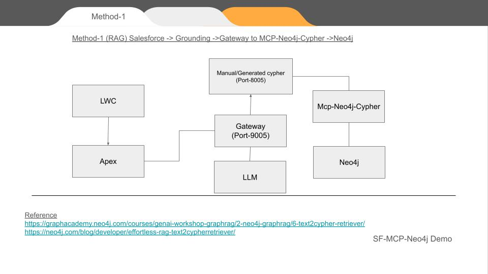
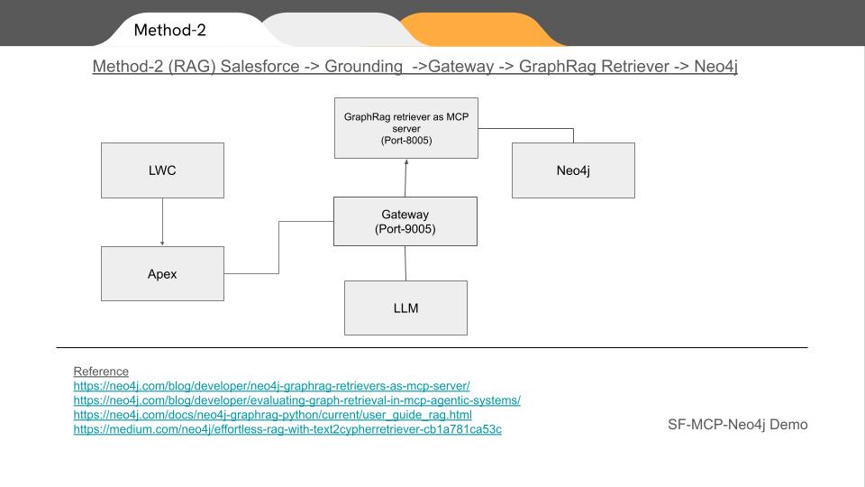
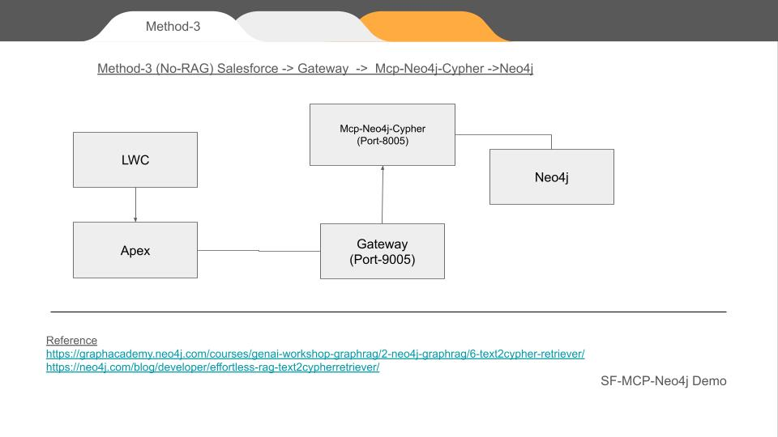
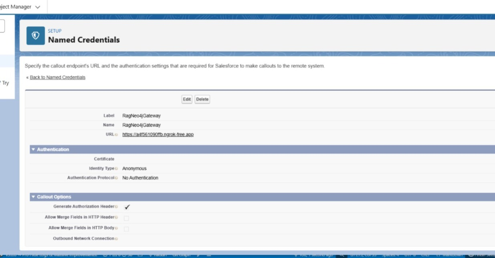
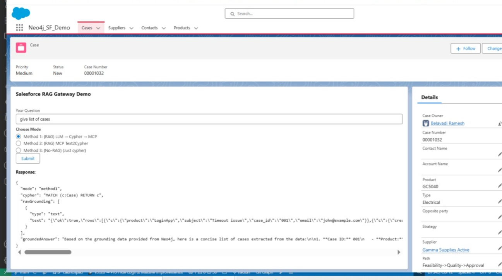
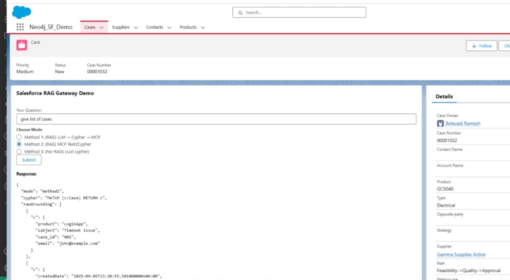
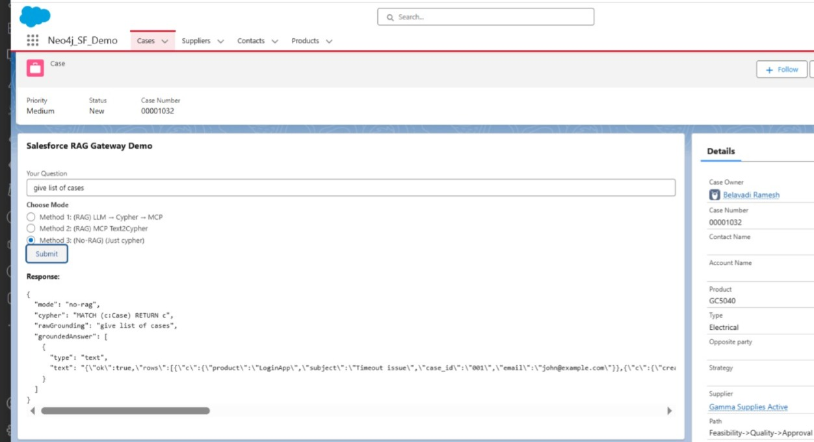

# 🚀 Integrating Salesforce with Neo4j Using MCP, RAG & LWC – A Practical Demo of Three Architectures

In this demo, I showcase **three different architectures** where **Salesforce interacts with Neo4j graph database** using **Modern Context Protocol (MCP)**, **GraphRAG**, and **custom Node.js gateway logic**.

My goal was simple:  
👉 *Expose Neo4j as a knowledge graph backend to Salesforce* in a way that developers can query graph data using **natural language**, **Cypher**, or **intelligent RAG translation**.

---

## 🎯 The Three Integration Methods

### ✅ **Method 1 – RAG with Direct MCP-Neo4j-Cypher**
```
Salesforce → Grounding → Node.js Gateway → MCP-Neo4j-Cypher → Neo4j
```

In this method, Salesforce sends a **natural language request**. The **MCP tool translates it to Cypher** using grounding logic and executes it directly against Neo4j.



---

### ✅ **Method 2 – RAG with GraphRag Retriever**
```
Salesforce → Grounding → Node.js Gateway → GraphRAG Retriever → Neo4j
```

Here, instead of translating NL to Cypher directly, we use **GraphRAG Text2CypherRetriever**. It returns **context-aware Cypher suggestions** with `top_k` ranking before execution.



---

### ✅ **Method 3 – Direct Cypher Execution (No-RAG Mode)**
```
Salesforce → Node.js Gateway → MCP-Neo4j-Cypher → Neo4j
```

This is the *developer mode*. We **bypass grounding and RAG**. Salesforce submits a Cypher query directly, routed via MCP.



---

## 🏗 Architecture Overview

| Layer | Component |
|-------|----------|
| UI Layer | **Lightning Web Component (LWC)** |
| Backend (Salesforce) | **Apex Controller → Named Credentials → HTTP Callouts** |
| Gateway | **Node.js MCP Client Gateway (Port 9005)** |
| MCP Services | **Python MCP Server (Port 8005)** exposing `text2cypher` and `read-cypher` |
| Data Layer | **Neo4j Graph Database** |

- LWC sends requests → Apex  
- Apex uses **Named Credentials + ngrok HTTPS endpoint**  
- Node.js Gateway converts Salesforce HTTP into MCP requests  
- Python MCP Server hosts tools that translate or execute Cypher

---

## 🎛 Why Apex + Named Credentials?

Salesforce **does not allow direct HTTP calls from LWC** due to security policy. So:

- **Apex makes the callout**
- **Named Credential exposes the gateway URL**
- **Ngrok provides temporary HTTPS URL**, because Named Credentials **do not accept HTTP**


---

## 🛠 MCP Tools Implemented (Python)

```python
# -----------------------
# Tool: text2cypher (GraphRAG)
# -----------------------

@mcp.tool(name="text2cypher")
def text2cypher_tool(query: str, top_k: int = 3):
    """
    Use Neo4j GraphRAG Text2CypherRetriever to generate Cypher via rag.search().
    """
    try:
        # ✅ Call correct official API for latest neo4j-graphrag
        result = rag.search(query_text=query)

        # The retriever can also be used without using graphRag
        # result = retriever.search(query_text=query)

        print (result)
        

        # fallback if result.cypher_query is missing
        
        cypher_query = (
            getattr(result, "cypher_query", None)
            or getattr(result, "cypher", None)
            or getattr(result, "query", None)
            or (getattr(result, "metadata", {}) or {}).get("cypher")
            or (getattr(result, "metadata", {}) or {}).get("cypher_text")
        )


        # ✅ Extract fields safely
        
        graph_data = getattr(result, "records", None)

        if not cypher_query:
            return {"error": "No Cypher generated", "raw": str(result)}

        # ✅ Execute Cypher via standard Neo4j session
        with driver.session() as session:
            data_rows = session.run(cypher_query)
            final_data = [record.data() for record in data_rows]

        return {
            "input": query,
            "cypher": cypher_query,
            "graphData": final_data
        }

    except Exception as e:
        return {"error": str(e)}


# -----------------------
# Helpers
# -----------------------
def _execute_cypher_return_rows(cypher_text: str, params: dict | None = None):
    """Execute a cypher string in read mode and return list of record.data() dicts."""
    params = params or {}
    with driver.session(default_access_mode="READ") as session:
        result = session.run(cypher_text, **params)
        return [rec.data() for rec in result]


# -----------------------
# Tool: read_neo4j_cypher
# -----------------------
@mcp.tool(name="read_neo4j_cypher")
def read_neo4j_cypher(query: str):
    """
    Execute read-only Cypher and return rows.
    """
    try:
        rows = _execute_cypher_return_rows(query)
        return {"ok": True, "rows": rows}
    except Exception as e:
        return {"ok": False, "error": str(e), "trace": traceback.format_exc()}


```

---


## 🛠 Gateway Implemented (Node.js)

```
// 1) Method 1: LWC -> Gateway -> translateToCypher(LM) -> MCP read_neo4j_cypher -> groundedAnswer -> return
app.post('/method1', async (req, res) => {
  try {
    const { naturalLanguage } = req.body;
    const cypherQuery = await translateToCypher(naturalLanguage);

    const client = await mcpClientPromise;
    const result = await client.callTool({ name: 'read_neo4j_cypher', arguments: { query: cypherQuery } });

	  console.log(result);

    const grounded = await groundedAnswer(naturalLanguage, result.content?.json || result.content?.text || result, cypherQuery);

    res.json({ mode: 'method1', cypher: cypherQuery, rawGrounding: result.content || null, groundedAnswer: grounded });
  } catch (err) {
    console.error(err);
    res.status(500).json({ error: err.message });
  }
});

// 2) Method 2: LWC -> Gateway -> MCP text2cyphertool -> returns cypher + grounding -> groundedAnswer -> return
app.post('/method2', async (req, res) => {

  console.log("method2 LWC -> Gateway -> MCP text2cyphertool");
  try {
    const { naturalLanguage } = req.body;
    const client = await mcpClientPromise;

    // Call the MCP tool that exposes text2cypher retriever on the Neo4j side
    const toolResult = await client.callTool({ name: 'text2cypher', arguments: { query: naturalLanguage } });

	  console.log(toolResult);
    // Expect toolResult.content to include { cypherQuery, graphData }
    // const cypherQuery = toolResult.content?.json?.cypherQuery || toolResult.content?.json?.cypher || (toolResult.content?.text || '').slice(0, 2000);


  const contentBlock = toolResult.content?.[0];
  if (contentBlock?.type === 'text' && contentBlock.text) {
    const parsed = JSON.parse(contentBlock.text);
    cypherQuery = parsed.cypher || parsed.cypherQuery || parsed.metadata?.cypher;
    graphData = parsed.graphData || parsed.rows || parsed.records || parsed.data;
  }


    console.log("cypherQuery = " + cypherQuery);
    // const graphData = toolResult.content?.json?.graphData || toolResult.content?.json?.rows || toolResult.content?.text || toolResult.content || {};
	

    console.log("graphData = " + graphData);

    const grounded = await groundedAnswer(naturalLanguage, graphData, cypherQuery);

    console.log("grounded = " + grounded);

    res.json({ mode: 'method2', cypher: cypherQuery, rawGrounding: graphData, groundedAnswer: grounded });
  } catch (err) {
    console.error(err);
    res.status(500).json({ error: err.message });
  }
});

// 3) No-RAG: direct query to DB
app.post('/no-rag', async (req, res) => {
  try {
    const { naturalLanguage } = req.body;
    const cypherQuery = await translateToCypher(naturalLanguage);

    const client = await mcpClientPromise;
    const result = await client.callTool({ name: 'read_neo4j_cypher', arguments: { query: cypherQuery } });

	  console.log(result);

    
    res.json({ mode: 'no-rag', cypher: cypherQuery, rawGrounding: naturalLanguage, groundedAnswer: result.content || null });
  } catch (err) {
    console.error(err);
    res.status(500).json({ error: err.message });
  }
});


```

## 🌍 Testing via cURL

```bash
curl -X POST https://a4f561090ffb.ngrok-free.app/method2   -H "Content-Type: application/json"   -d @naturaldemo.json
```

**Input JSON (`naturaldemo.json`)**
```json
{"naturalLanguage": "Find list of cases"}
```

**Response**
```json

curl -X POST https://a4f561090ffb.ngrok-free.app/method2   -H "Content-Type: application/json"   -d @naturaldemo.json
{"mode":"method2","cypher":"MATCH (c:Case) RETURN c","rawGrounding":[{"c":{"product":"LoginApp","subject":"Timeout issue","case_id":"001","email":"john@example.com"}},{"c":{"createdDate":"2025-09-09T13:20:55.501000000+00:00","subject":"Cannot login","caseNumber":"00012345","id":"5005j00001ABC123","priority":"High","status":"Closed"}},{"c":{"createdDate":"2025-09-09T13:20:55.501000000+00:00","subject":"Payment failed","caseNumber":"00012346","id":"5005j00001ABC456","priority":"Medium","status":"In Progress"}},{"c":{"subject":"The server is crashing in weekend"}}],"groundedAnswer":"To find the list of cases from the provided grounding data, we can extract the relevant information from each case entry. The grounding data contains several cases with different attributes. Here’s a concise summary of the cases identified:\n\n1. **Case ID: 001**\n   - **Product:** LoginApp\n   - **Subject:** Timeout ....
...
}


```

---


## 💻 Apex Code to access Gateway (RagGatewayController)

```apex

public with sharing class RagGatewayController {
  @AuraEnabled(cacheable=false)
  public static Object getMcpResponse(String input, String mode) {
    Http http = new Http();
    HttpRequest req = new HttpRequest();

    String baseUrl = 'callout:RagNeo4jGateway/'; // Replace with actual host
    
    String endpoint = baseUrl + '/' + mode; // mode = method1, method2, no-rag

    req.setEndpoint(endpoint);
    req.setMethod('POST');
    req.setHeader('Content-Type', 'application/json');

    Map<String, Object> payload = new Map<String, Object>{ 'naturalLanguage' => input };
    req.setBody(JSON.serialize(payload));

    HttpResponse res = http.send(req);
    if (res.getStatusCode() == 200) {
      return JSON.deserializeUntyped(res.getBody());
    } else {
      throw new AuraHandledException('Gateway error: ' + res.getStatus());
    }
  }
}


```

---

## 💻 Apex Test Code (Anonymous Execution)

```apex
try {
    String input = 'Find suppliers in Bangalore';
    String mode = 'method1'; // method2, no-rag also valid

    Object result = RagGatewayController.getMcpResponse(input, mode);
    System.debug('✅ Result:
' + JSON.serializePretty(result));

} catch (Exception e) {
    System.debug('❌ Exception: ' + e.getMessage());
}
```

---

## 🔌 Gateway (Node.js MCP Client) – Runs on 9005
> Acts as HTTP to MCP bridge. Receives `/method1`, `/method2`, `/no-rag` POST and forwards to MCP server.

---

## 🐍 Python MCP Server – Runs on 8005
> Exposes **GraphRAG Text2CypherRetriever** and **read-only Cypher execution**.

---

## 🎨 LWC App – UI Layer

- 3 buttons → *Method 1*, *Method 2*, *No-RAG*
- Input field for natural language
- Displays JSON result from Neo4j via gateway


```


import { LightningElement, track } from 'lwc';
import getMcpResponse from '@salesforce/apex/RagGatewayController.getMcpResponse';

export default class RagGatewayDemo extends LightningElement {
  @track userInput = '';
  @track selectedMode = 'method1';
  @track response;

  modeOptions = [
    { label: 'Method 1: (RAG) LLM → Cypher → MCP', value: 'method1' },
    { label: 'Method 2: (RAG) MCP Text2Cypher', value: 'method2' },
    { label: 'Method 3: (No-RAG) (Just cypher)', value: 'no-rag' }
  ];

  handleInput(event) {
    this.userInput = event.target.value;
  }

  handleModeChange(event) {
    this.selectedMode = event.detail.value;
  }

  async handleSubmit() {
    try {
      const result = await getMcpResponse({ input: this.userInput, mode: this.selectedMode });
      this.response = JSON.stringify(result, null, 2);
    } catch (error) {
      this.response = 'Error: ' + error.body.message;
    }
  }
}

```

## LWC html

```
<template>
  <lightning-card title="Salesforce RAG Gateway Demo">
    <div class="slds-p-around_medium">
      <lightning-input label="Your Question" value={userInput} onchange={handleInput}></lightning-input>
      <lightning-radio-group
        name="mode"
        label="Choose Mode"
        options={modeOptions}
        value={selectedMode}
        onchange={handleModeChange}>
      </lightning-radio-group>
      <lightning-button label="Submit" onclick={handleSubmit} class="slds-m-top_medium"></lightning-button>
      <template if:true={response}>
        <p class="slds-m-top_medium"><strong>Response:</strong></p>
        <pre>{response}</pre>
      </template>
    </div>
  </lightning-card>
</template>
```

---

## 📸 Screenshots 

- 📷 LWC with 3 tabs




---

## 🔮 Final Thoughts

This experiment proves that **Salesforce is no longer just CRM** – it can **orchestrate graph intelligence via MCP and Neo4j**. With **GraphRAG**, **grounded cypher generation**, and **structured MCP tools**, we can turn Salesforce into a **graph-aware intelligent console**.


